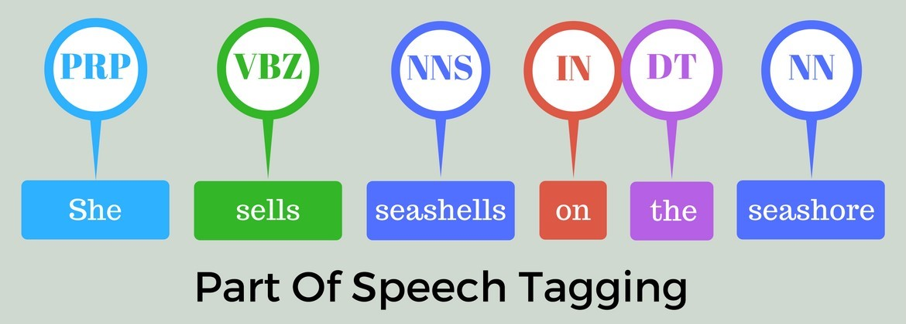
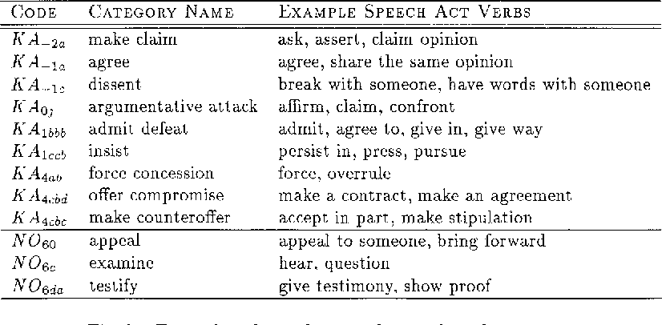
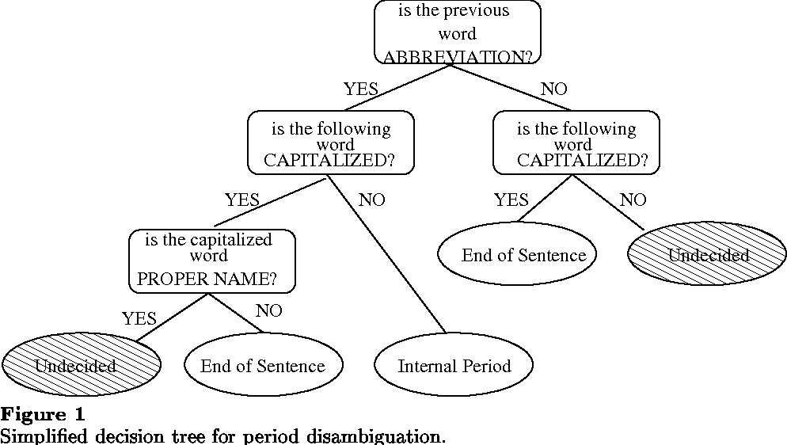

# 08-04

## Following Papers - Highest Interest

* [Detecting Speech Act Types in Developer Question/Answer Conversations during Bug Repair](papers/BugRepairSpeechActs.pdf)
* [Automatically Identifying Complaints in Social Media](papers/ComplaintsSocialMedia.pdf)
* [Automatic Extraction of Discussion based on Sentence Type Estimation](papers/ExtractionOfDiscussion.pdf)
* [RECURRENT CONVOLUTIONAL NEURAL NETWORKS FOR STRUCTURED SPEECH ACT TAGGING](papers/RecurrentCNNStructuredSATagging.pdf)
* [Open Secrets and Wrong Rights: Automatic Satire Detection in English Text](papers/SatireDetectionSpeechAct.pdf)
* [Automated Speech Act Categorization of Chat Utterances in Virtual Internships](papers/SpeechActInChat.pdf)
* [Tweet Acts: A Speech Act Classifier for Twitter](papers/SpeechActTwitter.pdf)
* [Discovering Speech Acts in Online Discussions: A Tool-supported method](papers/SpeechActsOnline.pdf)

### A great number of papers use POS Tagging before classifying the speech acts.

Pos is a very simple and ""Solved"" problem, using POS increases the accuracy of the speech act classification.

The advantage of using POS is that we can identify the verbs and use verbs that are related to certain speech acts through a given taxonomy.

eg:

Another great advantage of POS tagging is that with it we can increment a very simple sentence disambiguation algorithm to separate the sentences in order to detect speech acts.

eg:

